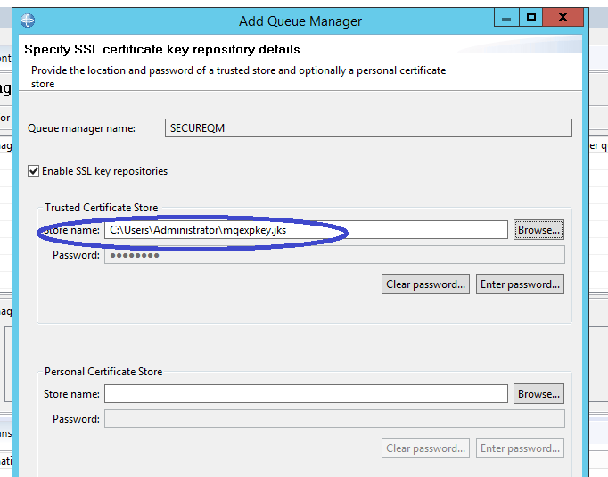
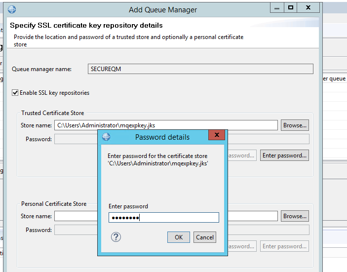
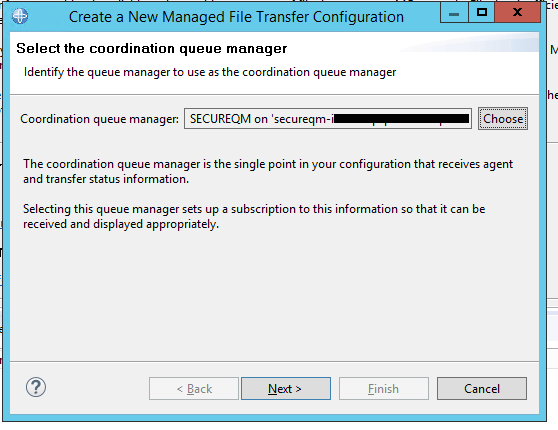
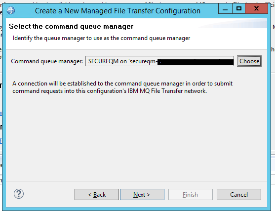
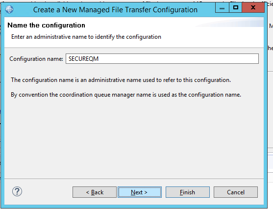
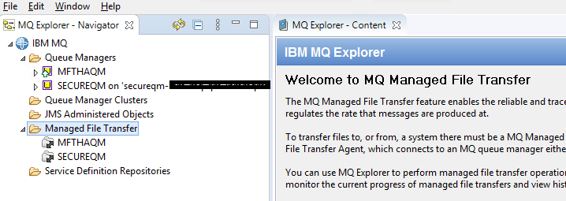
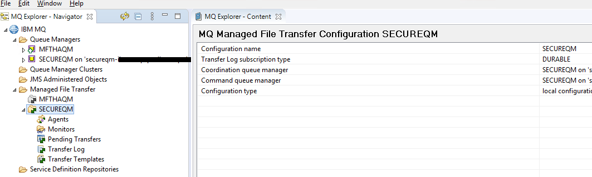

# Monitoring transfers using MQExplorer MFT Plugin

MQExplorer Managed File Transfer Plugin can be used to monitor various features on your managed file transfer network, including the transfers running in a OpenShift Container Platform. The plugin can be configured to connect to a locally running coordination queue manager or remote coordination queue manager. MQExplorer can be run on Windows and Linux platforms.

This document describes the steps required to configure MQExplorer on Windows to connect to a coordination queue manager running in OpenShift Platform to monitor transfers.

Prerequisites:
- You must first have completed the following prerequisites:
- Install stand-alone MQExplorer using the steps provided here https://www.ibm.com/support/knowledgecenter/SSFKSJ_9.2.0/com.ibm.mq.ins.doc/q133380_.html
- Create an OpenShift Container Platform (OCP) project/namespace for this example. This document assumes the namespace as `ibmmqmftmqexp`
- Ensure the IBM MQ Operator is installed and available in the above namespace. Follow the steps here https://www.ibm.com/support/knowledgecenter/en/SSFKSJ_9.2.0/com.ibm.mq.ctr.doc/ctr_install_uninstall.htm to install IBM MQ Operator.
- Install OpenShift command line client (OC) for Windows.
- Install the OpenSSL tool for Windows. It can be downloaded from here - https://slproweb.com/products/Win32OpenSSL.html


**Step #1**

On the command line, log into the OCP cluster, and switch to the namespace `ibmmqmftmqexp` you created above.

`oc login --token='your token' --server='OpenShift URL'`

`oc project ibmmqmftmqexp`


**Step #2**

Create a self-signed private key and a public certificate in the current directory

Run the following command:

`openssl req -newkey rsa:2048 -nodes -keyout tls.key -subj "/CN=localhost" -x509 -days 3650 -out tls.crt`


**Step #3**

Add the server public key to a client key database
The key database is used as the trust store for the client application. MQExplorer is our client application in this case and it is a Java client application. Hence, we need to create trust store of type `jks`. Create the client key database:

`runmqckm -keydb -create -db mqexpkey.jks -pw password -type jks`


**Step #4**

Add the previously generated public key to the client key database:

`runmqckm -cert -add -db mqexpkey.jks -label mqservercert -file tls.crt -format binary`


**Step #5**

Configure TLS Certificates for Queue Manager deployment so that your queue manager can reference and apply the key and certificate, create a Kubernetes TLS secret, referencing the files created above. When you do this, ensure you are in the namespace you created before you began this task.

`oc create secret tls example-tls-secret --key="tls.key" --cert="tls.crt"`


**Step #6**

Create a config map containing MQSC commands. Create a Kubernetes config map containing the MQSC commands to create a new queue and a SVRCONN Channel, and to add a channel authentication record that allows access to the channel by blocking only those users called nobody. Since the queue manager that we will be creating will be the coordination queue manager, we will add the additional script to create required objects as well.

Create a YAML file, say `mqexplcfg.yaml` with the following content.

```
apiVersion: v1
kind: ConfigMap
metadata:
  name: example-tls-configmap
data:
  mqexpl.mqsc: |
    DEFINE CHANNEL(SECUREQMCHL) CHLTYPE(SVRCONN) TRPTYPE(TCP) SSLCAUTH(OPTIONAL) SSLCIPH('ANY_TLS12_OR_HIGHER')
    SET CHLAUTH(SECUREQMCHL) TYPE(BLOCKUSER) USERLIST('nobody') ACTION(ADD)
    DEFINE TOPIC('SYSTEM.FTE') TOPICSTR('SYSTEM.FTE') REPLACE
    ALTER TOPIC('SYSTEM.FTE') NPMSGDLV(ALLAVAIL) PMSGDLV(ALLAVAIL)
    DEFINE QLOCAL(SYSTEM.FTE) LIKE(SYSTEM.BROKER.DEFAULT.STREAM) REPLACE
    ALTER QLOCAL(SYSTEM.FTE) DESCR('Stream for MQMFT Pub/Sub interface')
    DISPLAY NAMELIST(SYSTEM.QPUBSUB.QUEUE.NAMELIST)
    ALTER NAMELIST(SYSTEM.QPUBSUB.QUEUE.NAMELIST) +
    NAMES(SYSTEM.BROKER.DEFAULT.STREAM+
    ,SYSTEM.BROKER.ADMIN.STREAM,SYSTEM.FTE)
    DISPLAY QMGR PSMODE
    ALTER QMGR PSMODE(ENABLED)
````


Create a config map with above YAML file
`oc apply -f mqexplcfg.yaml`


**Step #7**

A Kubernetes route needs to be created so that MQExplorer can connect to the coordination queue manager.

Create a YAML, say `mqexplroute.yaml` file with the following content. Note: The first part of the host much match the channel name created above. 

```
apiVersion: route.openshift.io/v1
kind: Route
metadata:
  name: example-tls-route
spec:
  host: secureqmchl.chl.mq.ibm.com
  to:
    kind: Service
    name: secureqm-ibm-mq
  port:
    targetPort: 1414
  tls:
    termination: passthrough
```

Create the route with the above YAML file.

`oc apply -f mqexplroute.yaml`


**Step #8**

The next step is to create the coordination queue manager.

Create a YAML file, say `secureqm.yaml` with the following content.

```
apiVersion: mq.ibm.com/v1beta1
kind: QueueManager
metadata:
  name: secureqm
spec:
  license:
    accept: true
    license: L-RJON-BUVMQX
    use: Production
  queueManager:
    name: SECUREQM
    mqsc:
    - configMap:
        name: example-tls-configmap
        items:
        - mqexpl.mqsc
    storage:
      queueManager:
        type: ephemeral
  template:
    pod:
      containers:
        - env:
            - name: MQSNOAUT
              value: 'yes'
          name: qmgr
  version: 9.2.1.0-r1
  web:
    enabled: false
  pki:
    keys:
      - name: example
        secret:
          secretName: example-tls-secret
          items: 
          - tls.key
          - tls.crt
```

Run the following command 

`oc apply -f secureqm.yaml`


**Step #9**

Confirm that queue manager is running. You may have to wait for few minutes for queue manager to go into running state.

`oc get qmgr secureqm`


**Step #10**

Find the host name of the coordination queue manager.

`oc get routes`

IBM MQ create another route automatically. Hence there will be two routes for your queue manager. You will be using the host name provided by the automatically created route. In the example below the second route is automatically generated. 
```
example-tls-route           secureqmchl.chl.mq.ibm.com                                              secureqm-ibm-mq          1414   passthrough   None
secureqm-ibm-mq-qm          secureqm-ibm-mq-qm-xxx.xxx.xxx.com                                      secureqm-ibm-mq          1414   passthrough   None
```

**Step #11**

1) Start MQExplorer by running `strmqcfg` command.

2) Right click on the `Queue Managers` node and click `Add Remote Queue Manger...` menu.

3) Type in the name of the coordination queue manager `SECUREQM`.

4) Select `Connect directly`.
   
   .

5) Press `Next` button on the page.

6) Provide the channel name got in step #10. Port as 443 and name of the channel (Refer step #6). See the picture below 

.

7) Press `Next` button on the page.

8) Leave the defaults as is on `Specify security exit details` and press `Next` button on the page.

9) Leave the defaults as is on `Specify user identification details` and press `Next` button on the page.

10) On the `Specify SSL certificate key repository details`, click on check box and provide the path to the jks file created above. You must ensure that the keystore is placed in a secure folder, like user's home directory, where only the logged in user has access to the file and no others have. See the picture below.

 .

9) Click on `Enter password` button to provide the password that was used to create the jks store .

10) Press `Next` button on the page.

11) On the `Specify SSL option details` page, click on `Enable SSL options` check box and select `ECDHE_RSA_AES_256_CBC_SHA384` as the Cipherspec. See picture below.

 .

12) Press `Finish` button on the page.

MQExplorer should now connect to coordination queue manager.


**Step #12:**

Configuring MFT Plugin

1) Right click on `Managed File Transfer` node in MQExplorer and click `New configuration` menu.

2) Click the `Choose` button and select the SECUREQM on the `Select the coordination queue manager` page. See picture below.

 .

3) Press `Next` button.

4) Select the SECUREQM on the `Select the command queue manager` page. 

.

5) Press `Next` button.

6) Provide a name for the configuration, you can choose the default provided.

.

7) Press `Next` button

8) Choose the required subscription type. Default is NON_DURABLE. 

.

9) Click `Finish`

10) You should see a new configuration created in the Managed File Transfer node.

.

11) Right click on the new configuration and click the `Connect` menu.

12) After connection succeeds, MFT resources like agents, would be displayed in the expanded node.

.


This completes the configuration.
